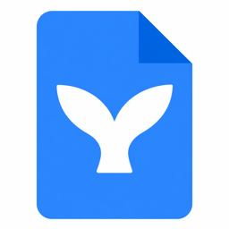
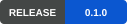
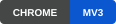
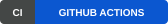

<p align="center">
  
</p>

<h1 align="center">Mermaid for Google Docs</h1>

<p align="center">Local Mermaid previews. Your source stays in the document.</p>

<p align="center">
  <a href="docs/roadmap.md"></a>
  <a href="docs/getting-started.md"></a>
  <a href="https://github.com/leracherry/google-docs-mermaid/actions/workflows/ci.yml"></a>
  <a href="LICENSE"></a>
</p>

<p align="center">
  <a href="docs/README.md">Docs</a> ·
  <a href="docs/roadmap.md">Roadmap</a> ·
  <a href="https://github.com/leracherry/google-docs-mermaid/releases">Releases</a> ·
  <a href="CONTRIBUTING.md">Contribute</a>
</p>

> **Developer alpha:** native Google Docs canvas integration is still pending. The screenshots and tests use DOM-backed fixtures.

<p align="center">
  
</p>

<details>
  <summary>Settings — light and dark</summary>
  <p align="center">
    
    
  </p>
</details>

## What it does

- Live previews with syntax-error recovery.
- Preview, Split, and Code views; zoom, expand, and copy source/SVG.
- Shared light/dark styling, global preferences, and per-document toggles.
- Local rendering with no backend, account, or telemetry.

Built with **TypeScript · WXT · React · Mermaid**.

## Develop

Requires Node.js 22+ and pnpm 10.18.0.

```sh
git clone git@github.com:leracherry/google-docs-mermaid.git
cd google-docs-mermaid
pnpm install --frozen-lockfile
pnpm dev
```

For a production build, run `pnpm build` and load `.output/chrome-mv3` at `chrome://extensions` with **Developer mode → Load unpacked**.

```sh
pnpm check
pnpm build
pnpm exec playwright install chromium
pnpm test:e2e
```

See [Development](docs/development.md) for fixture testing, screenshots, and packaging. The latest release predates the styling on `main`; repository access is required while the project is private.

## Contribute

Read [Contributing](CONTRIBUTING.md), browse the [roadmap](docs/roadmap.md), or [report a bug](https://github.com/leracherry/google-docs-mermaid/issues/new/choose). See [Security](SECURITY.md) for sensitive reports and [Privacy](docs/privacy.md) for data handling.

## License

[MIT](LICENSE). Third-party dependencies retain their own licenses; see [notices](THIRD_PARTY_NOTICES.md). This project is not affiliated with Google.
