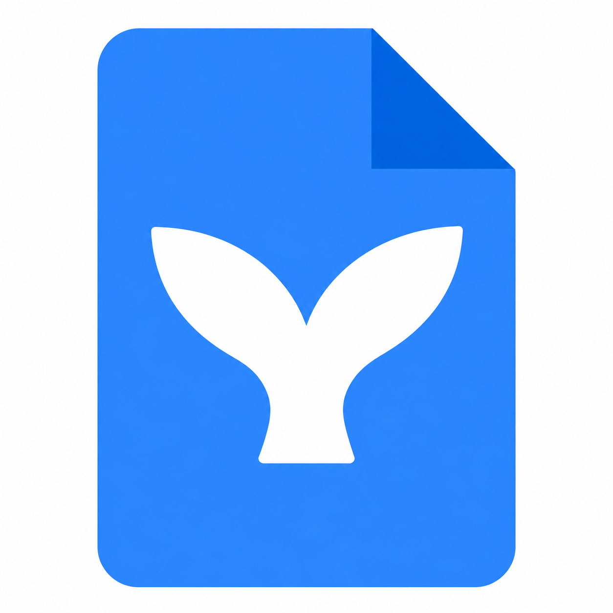
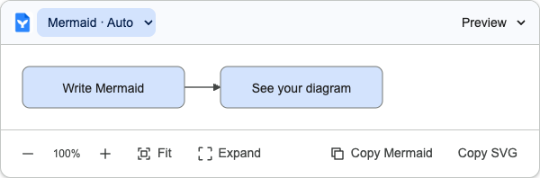
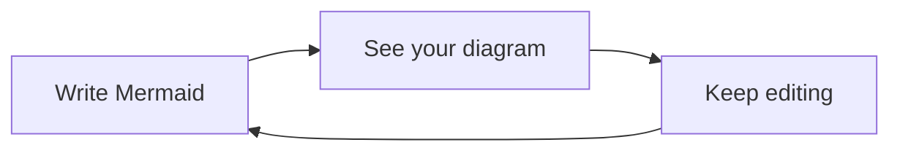

<p align="center">
  
</p>
<h1 align="center">Mermaid for Google Docs</h1>
<p align="center">Diagrams, right where you write.</p>
<p align="center">
  <a href="https://github.com/leracherry/google-docs-mermaid/actions/workflows/ci.yml"></a>
  <a href="https://github.com/leracherry/google-docs-mermaid/releases">Releases</a> ·
  <a href="docs/development.md">Development</a> ·
  <a href="docs/design-system.md">Design system</a> ·
  <a href="CONTRIBUTING.md">Contributing</a>
</p>

A Chrome extension that recognizes Mermaid source, renders diagrams locally, and adds compact preview controls inside Google Docs. Your source stays in the document; diagrams are rendered on your device.

> **Early alpha · v1 in development.** The rendering pipeline works on DOM-backed code blocks. Reliable extraction from the native Google Docs canvas editor and native Markdown files is still unverified. This is a developer preview, not a finished Google Docs integration. Follow the [v1 roadmap](docs/roadmap.md).

## A familiar place for diagrams

- **Live previews.** Changes render after a short pause; syntax errors preserve the last valid diagram.
- **Source-first controls.** Switch between Preview, Split, and Code without replacing the original text.
- **Room to explore.** Zoom, fit, expand, and copy Mermaid source or SVG.
- **Workspace-inspired visuals.** Shared colors, rounded cards, thin outlines, and restrained connectors across the controls and diagrams, with light/dark themes and keyboard focus states.
- **Local by default.** No backend, account, OAuth, telemetry, or remote rendering.
- **Your preferences.** Choose a theme, toggle detection, and disable previews for a document.

## Preview

<p align="center"></p>
<p align="center"> </p>

These screenshots show the actual extension on a test fixture. They do not demonstrate native Google Docs canvas support.

## Try the alpha

1. Download the extension ZIP from [Releases](https://github.com/leracherry/google-docs-mermaid/releases) and extract it.
2. Open `chrome://extensions` and enable **Developer mode**.
3. Select **Load unpacked**, then choose the extracted folder containing `manifest.json`.
4. Open the toolbar menu and pin **Mermaid for Google Docs** to access settings.

There is no Chrome Web Store listing yet. A standard Google Docs document may show no previews until the canvas adapter is implemented. For a reproducible rendering check, use the browser fixture described in [Development](docs/development.md).

## Mermaid source

The intended workflow is to write Mermaid in a code block:



Explicit `mermaid` fences are detected even while their syntax is incomplete. Unlabeled blocks use a cheap candidate check followed by Mermaid validation. Blocks marked with another language are left alone.

## Build and test

Requires Node.js 22+ and pnpm 10.18.0.

```sh
git clone git@github.com:leracherry/google-docs-mermaid.git
cd google-docs-mermaid
pnpm install --frozen-lockfile
pnpm check
pnpm build
pnpm exec playwright install chromium
pnpm test:e2e
```

Load `.output/chrome-mv3` in Chrome to use the local build. `pnpm dev` starts development mode; `pnpm zip` packages the extension. Repository access is required while the project is private.

CI checks TypeScript, unit tests, the production build, and Chromium scenarios against the built extension. Version tags run the same checks before publishing a release ZIP. See the [release process](docs/development.md#releases).

## Current limits

| Area | Alpha behavior |
| --- | --- |
| Google Docs integration | DOM-backed `pre`, `[data-code-block]`, and `[role="code"]` surfaces; live canvas extraction pending |
| Markdown files | Fence detection implemented; native Docs Markdown workflow unverified |
| Block preferences | Session-only; document enable/disable persists locally |
| Split view | Read-only source copy; edit the original document in Code view |
| Auto theme | Follows the device; separate Docs appearance is not detected |
| Expanded viewer | Scroll and zoom supported; drag-to-pan pending |
| Performance | Mermaid initialization deferred; renderer is bundled into the content script |

## Documentation

| Guide | What it covers |
| --- | --- |
| [Getting started](docs/getting-started.md) | Installation, controls, and troubleshooting |
| [Development](docs/development.md) | Local setup, checks, screenshots, and releases |
| [Architecture](docs/architecture.md) | Adapter boundary, rendering pipeline, and security |
| [Design system](docs/design-system.md) | Google design research, shared tokens, and UI rules |
| [Roadmap](docs/roadmap.md) | v1 milestones and remaining feasibility work |
| [Privacy](docs/privacy.md) | Permissions, local storage, and document data |
| [Changelog](CHANGELOG.md) | Shipped changes and work on main |

## Contribute

Bug reports, focused improvements, and verified Google Docs integration research are welcome. Start with [CONTRIBUTING.md](CONTRIBUTING.md) and the [Code of Conduct](CODE_OF_CONDUCT.md). Use the issue templates for bugs and proposals; report sensitive findings through the [security policy](SECURITY.md).

## License and credits

Licensing is not yet selected; `UNLICENSED` is intentional. See [third-party notices](THIRD_PARTY_NOTICES.md) for dependency licenses. The whale-tail artwork was supplied by the project owner and is used as the project identity; this does not establish a separate redistribution license for the artwork.

This is an independent project inspired by Google's [Material design system](https://m3.material.io/) and [Workspace guidance](https://developers.google.com/workspace/add-ons/guides/workspace-best-practices). It is not affiliated with or endorsed by Google. Google Docs is a trademark of Google LLC.
