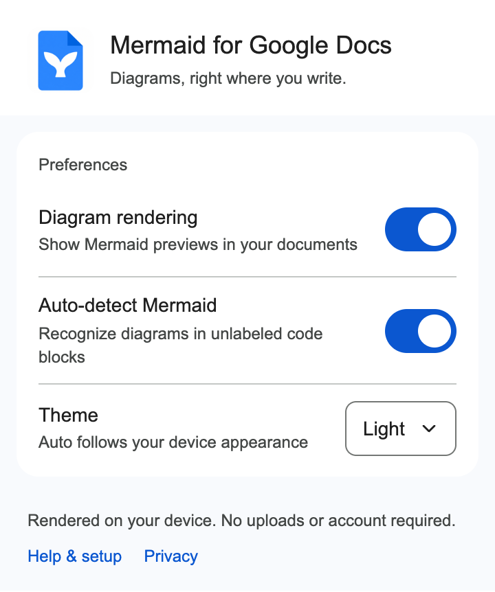
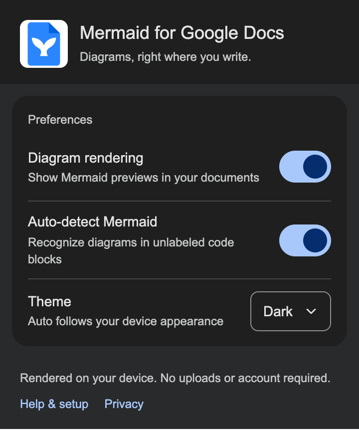

# Design system

[Documentation](README.md) · [Project overview](../README.md)

The extension uses a restrained Workspace-inspired treatment: blue accents, neutral surfaces, compact desktop controls, readable labels, and predictable focus states. These are documented project decisions informed by Google's published guidance. Exact internal Docs component tokens are not a public API.

## Shared implementation

[design-tokens.ts](../src/styles/design-tokens.ts) is the single source for UI colors and geometry. It generates CSS variables for the popup and Shadow DOM; [themes.ts](../src/mermaid/themes.ts) derives the diagram theme and embedded SVG styling from those values.

| Role | Light | Dark |
| --- | --- | --- |
| Primary | `#0b57d0` | `#a8c7fa` |
| Primary container | `#d3e3fd` | `#0842a0` |
| Surface | `#ffffff` | `#1f1f1f` |
| On surface | `#1f1f1f` | `#e3e3e3` |
| Supporting text | `#444746` | `#c4c7c5` |
| Outline | `#747775` | `#8e918f` |
| Outline variant | `#c4c7c5` | `#444746` |

These palette values align the project with Workspace; they are not an official Google Docs styling API. Auto theme follows device appearance.

## Shapes, lines, and type

| Element | Treatment |
| --- | --- |
| Diagram card | 8px corners where rectangular; 1px neutral outline; no node shadow |
| Inline preview container | 12px corners and restrained elevation |
| Settings surface | 16px corners with tonal separation |
| Expanded viewer | 28px corners and a neutral scrim |
| Buttons | Pill shape; 36px compact desktop target |
| Touch controls | At least 48px high on coarse-pointer surfaces |
| Connectors | 1.5px strokes with rounded joins; preserve semantic dashes and thickness |
| Toolbar icons | 2px strokes |
| UI dividers | 1px neutral strokes |
| Popup title/body/support | 18px/14px/12px with a clear hierarchy |

Use 4px spacing increments and 12–16px content padding. Font preferences are Google Sans, locally installed Roboto, then Arial/sans-serif. No fonts are downloaded.

## Diagram behavior

Mermaid uses its customizable base theme and classic look. Shared colors cover nodes, actors, notes, activations, clusters, state/class labels, relations, chart series, Gantt tasks, and architecture edges.

The SVG receives shape and line styling before sanitization, so **Copy SVG** retains the treatment. Diamonds, circles, stadiums, arrowheads, dashed connectors, and deliberately thick/invisible edges keep their meaning. Source-provided colors can still express semantic emphasis; the original source is never rewritten.

## Interaction and accessibility

Use native buttons, selects, and checkbox-backed switches. Give icon-only controls accessible names and tooltips. Keep actions readable at rest; use visible focus rings and subtle hover/pressed fills.

Errors have text and a warning icon, not color alone. Expanded view contains focus, closes with Escape, and restores focus. Settings are disabled while loading/saving; failed writes restore the prior value and show a recovery message.

State transitions last 150ms and respect reduced motion. The implementation does not attempt Material's expressive motion system.

## Visual examples

These screenshots show the production extension on DOM-backed demo fixtures.

### Flowchart

  

### Sequence diagram

  

### Settings in light mode

  

### Settings in dark mode

  

## Brand assets

The supplied source artwork is [logo.png](assets/logo.png). The centered README header uses the compact [logo-small.png](assets/logo-small.png) derivative. Chrome variants are in [public/icons](../public/icons) at 16, 32, 48, and 128px.

Preserve the blue document, white whale tail, folded corner, proportions, and white background. Reuse the identity and tokens in future options pages and store materials; those products have not been created yet.

## Review checklist

Check both themes, keyboard navigation, focus visibility, reduced motion, disabled states, label clipping, normal document scrolling, icon legibility, and copied SVG appearance. Generate screenshots through the [documented workflow](development.md#screenshots).

## References

| Official source | How it informs the project |
| --- | --- |
| [Workspace web refresh](https://workspaceupdates.googleblog.com/2023/03/refreshed-ui-google-drive-docs-sheets-slides.html) | Establishes Workspace's adoption of Material Design 3 |
| [Material color roles](https://m3.material.io/styles/color/the-color-system) | Semantic surface, primary, outline, and error roles |
| [Material typography](https://m3.material.io/styles/typography/applying-type) | Title, body, label, and supporting-text hierarchy |
| [Material Web typography](https://github.com/material-components/material-web/blob/main/docs/theming/typography.md) | Local font-stack decisions |
| [Material states](https://m3.material.io/foundations/interaction/states/overview) | Hover, pressed, disabled, and focus treatments |
| [Material shape guidance](https://developer.android.com/codelabs/m3-design-theming) | Role-based corner hierarchy |
| [Google touch targets](https://support.google.com/accessibility/android/answer/7101858) | Coarse-pointer target sizes |
| [Workspace best practices](https://developers.google.com/workspace/add-ons/guides/workspace-best-practices) | Focused controls and narrow permissions |
| [Editor add-on styling](https://developers.google.com/workspace/add-ons/guides/css) | Visual continuity with the host editor |

This is a Manifest V3 extension, not an Apps Script or Card-service add-on. Platform-specific widget, OAuth, and publishing requirements from those guides are not extension implementation requirements.

Dropdowns retain native selection and keyboard behavior. A shared 16px chevron sits 12px inside the control edge, with 36px of trailing text padding. Popup theme, block mode and view controls use the same spacing in both themes.
