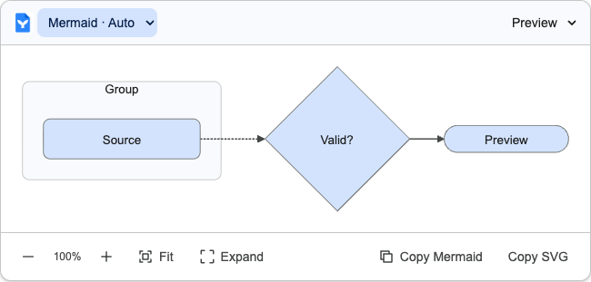
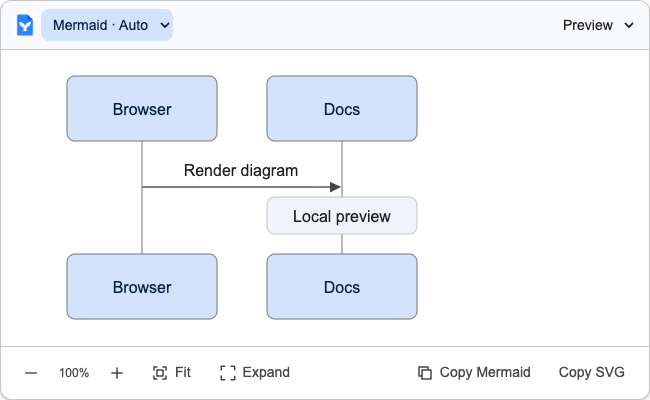

# Design system

Mermaid for Google Docs should feel at home beside the document. It uses a restrained Workspace-inspired interpretation of Material: blue accents, neutral surfaces, compact desktop controls, clear type hierarchy, and predictable interaction states. These are project choices based on the sources below, not an official Google Docs component specification.

## Research and decisions

| Official reference | Applied decision |
| --- | --- |
| [Material color roles](https://m3.material.io/styles/color/the-color-system) | Shared semantic surface, primary, outline, and error roles; pair foreground and background colors in each theme |
| [Material typography](https://m3.material.io/styles/typography/applying-type) | Distinguish title, body, label, and supporting text rather than making every element bold |
| [Material Web typography](https://github.com/material-components/material-web/blob/main/docs/theming/typography.md) | Prefer Google Sans when available, then locally installed Roboto and Arial; do not fetch fonts remotely |
| [Material interaction states](https://m3.material.io/foundations/interaction/states/overview) | Explicit hover, pressed, disabled, and keyboard focus states |
| [Google touch target guidance](https://support.google.com/accessibility/android/answer/7101858) | 48px targets on coarse-pointer surfaces; desktop diagram buttons remain compact at 36px |
| [Workspace best practices](https://developers.google.com/workspace/add-ons/guides/workspace-best-practices) | Add the missing capability, keep controls focused, limit permissions, and handle errors close to their cause |
| [Editor add-on styling guidance](https://developers.google.com/workspace/add-ons/guides/css) | Aim for visual continuity with the editor; bundle our own CSS instead of loading Google's legacy CSS package |

The extension is Manifest V3, not an Apps Script or Card-service add-on. Card widgets, OAuth scope rules, and publishing requirements from those platforms are not adopted as extension implementation requirements.

## Shared tokens

`src/styles/design-tokens.ts` is the source for popup and Shadow DOM styling. Use semantic roles, not feature-specific color literals.

| Role | Light | Dark |
| --- | --- | --- |
| Primary | `#0b57d0` | `#a8c7fa` |
| Primary container | `#d3e3fd` | `#0842a0` |
| Surface | `#ffffff` | `#1f1f1f` |
| On surface | `#1f1f1f` | `#e3e3e3` |
| Supporting text | `#444746` | `#c4c7c5` |
| Outline variant | `#c4c7c5` | `#444746` |

These are Workspace-inspired project palette values, not a claim that Google publishes these exact values as the Docs design API. Theme Auto follows device appearance. A separate Docs theme detector is pending.

## Layout and typography

- Use 4px increments for spacing, with 12–16px content padding.
- Popup: 360px wide; 18px/24px title, 14px body, 12px supporting text.
- Inline preview: 12px corners; settings surfaces: 16px corners; expanded viewer: 28px corners; text buttons: pill shape.
- Keep the document visually dominant. Brand the popup header and show only a small logo in each block's header.
- Keep actions readable at rest. Do not reduce toolbar text opacity merely to make the UI look quiet.
- Use icons to support labels; icon-only buttons need accessible names and tooltips.

## Interaction and accessibility

Use native buttons, selects, and checkbox-backed switches. Tab order follows the visual order. Every control has a visible focus ring; errors use text and a warning icon, not color alone. Expanded view has a dialog role, focus containment, Escape dismissal, and focus restoration.

Hover and pressed fills are subtle. Transitions are limited to 150ms color/state changes; respect `prefers-reduced-motion`. This restrained desktop choice does not attempt to implement Material's expressive motion system.

Settings are disabled while loading or saving. A failed write leaves the previous value in place and shows a recovery message. Auto theme responds to device appearance changes. No fonts, icon services, or stylesheets are requested from external hosts.

## Brand assets

The supplied artwork is preserved in `docs/assets/logo.png`. `public/icons/16.png`, `32.png`, `48.png`, and `128.png` are resized PNG derivatives for Chrome's manifest and action. Keep the blue document, white whale tail, folded corner, original proportions, and white background. Do not recreate it with a substitute symbol.

For future options pages and store materials, reuse this logo, palette, type hierarchy, plain language, and spacing. Store assets and a public landing page have not been created yet.

## Review checklist

Check the popup and diagram in both themes, keyboard-only navigation, focus visibility, reduced motion, disabled states, clipped labels, normal document wheel scrolling, and icon legibility at actual size. Screenshots must come from the real built extension and be labeled as fixtures when native Docs integration has not been verified.

## Diagram colors

Mermaid uses its customizable base theme with matching blue node fills, neutral connectors, and the same local font stack as the controls. Renderer theme variables are derived from the same light/dark palette used by the UI. Source-provided diagram styling can still change individual nodes; we do not rewrite user source.

## Consistency pass

The shared TypeScript tokens generate the popup/overlay CSS variables and Mermaid theme values. Colors cannot drift between separately maintained CSS and renderer palettes. Flat, softly rounded diagram cards use 8px corners, 1px neutral outlines, and 1.5px connectors. Toolbar icons use a consistent 2px stroke; UI dividers remain 1px. Native toolbar selectors use quiet backgrounds instead of boxed input borders. Settings cards use tonal separation and 16px corners rather than outlining every section.

Mermaid's classic look avoids its automatic node shadows. The SVG receives embedded shape and line styling before sanitization, so copying SVG retains the same appearance. Flowchart diamonds, circles, stadium shapes, dashed connectors, and deliberately thick/invisible edges retain their meaning. Diagram-specific theme variables also cover actors, notes, activations, clusters, state/class labels, relations, timeline/category colors, pie/XY charts, Gantt tasks, and architecture edges. Explicit source-provided colors remain available for semantic emphasis; the document source is never rewritten.

Google confirms that the [Workspace web refresh follows Material Design 3](https://workspaceupdates.googleblog.com/2023/03/refreshed-ui-google-drive-docs-sheets-slides.html). The [Material shape guidance](https://developer.android.com/codelabs/m3-design-theming) informs our role-based corner hierarchy. Exact internal Docs component tokens are not a public API, so these values are our documented Workspace-aligned implementation rather than a pixel-perfect certification.

## Rendered examples

These are screenshots of the built extension on fixtures, not native canvas compatibility claims.

